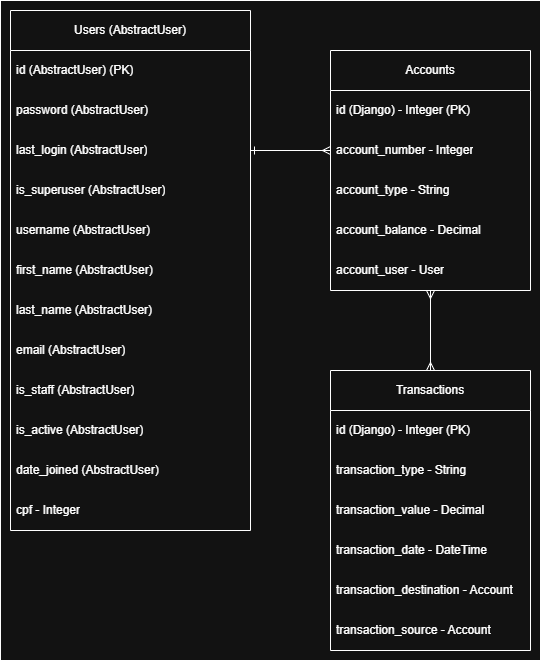

# Projeto

Desenvolvimento de API Rest com Python e Django. Segue conjunto de tecnologias utilizadas:

* pyenv: gerenciados de versões do Python.
* venv: módulo nativo para criação do ambiente virtual
* poetry: gerenciador de dependências e bibliotecas do projeto
* django: framework web em Python para o desenvolvimento rápido de aplicações. 
* django REST Framework: framework construído sobre o Django, para criar APIs RESTful. 
* django-cors-headers: biblioteca para lidar com Cross-Origin Resource Sharing (CORS) em projetos Django.

O projeto foi dividido nas seguintes etapas:

[ ] Configuração do Ambiente
[ ] Definições do Framework
[ ] Objetos e Relacionamentos
[ ] Migrations e Banco de Dados
[ ] Autenticação e JWT
[ ] CRUD e demais Requisições


## Configuração do Ambiente

* *pyenv* - Selecionada a versão do Python (3.13.1 - a mais recente dado que não existe necessidade explicita de versão);
* *venv* - Criação de ambiente virtual;
* *poetry* - Gerenciamento de pacotes e requerimentos;
* *python-dotenv* - Gerenciamento de variáveis de ambiente;
* *psycopg2-binary* - Conexão com banco PostgreSQL;
* *django[bcrypt]* - criptografia das senhas de usuários;
* *djangorestframework-simplejwt* - autenticação JWT (Bearer Token);
* *drf-yasg* - documentação endpoints da API

Segue configuração inicial:

```
pyenv local 3.13.1
python -m venv .venv
poetry init
poetry add django
poetry add djangorestframework
poetry add django-cors-headers
poetry add python-dotenv
poetry add psycopg2-binary
poetry add django[bcrypt]
poetry add djangorestframework-simplejwt
poetry add drf-yasg

```

## Django

Initializando o projeto com os comandos:

```
django-admin startproject api_root .
py manage.py startapp api_rest
```

Alterar o arquivo */api_root/settings*:
* Em INSTALLED_APPS adicionar:
    * 'rest_framework', # REST framework adicionado
    * 'corsheaders', # corsheaders adicionado
    * 'api_rest' # aplicação

* Em MIDDLEWARE adicionar:
    * 'corsheadres.middleware.CorsMiddleware' 

* Adicionar no final (alterar/adicionar o endereço de produção posteriormente - AWS, GCP, Azure) :
    * CORS_ALLOW_ORIGINS = ['https://localhost:8080']

* Pode ser necessário adicionar o seguinte para acesso de diversos locais:
    * CORS_ORIGIN_ALLOW_ALL = True

### Objetos e Relacionamentos

O projeto irá utilizar os modelos

* Users - herdando *AbstractUser* para funções de validação, autenticação e definição de senhas, além de campos padronizados (como username, email, password...). Um usuário pode ter diversas contas.

* Accounts - Modelo para informações da conta. Cada conta é vinculada a um único usuário, mas pode estar vinculada a diversas transações.

* Transactions - Modelo para informações das transacões. Cada Transacão é vinculada a duas contas ('Origem' e 'Destino')



### Banco de dados

Definidos os objetos e as relações, os é possível criar uma migration. Antes disso, configurar a conexão com PostgreSQL. Garantir que o usuário tenha permissão para realizar a criação/modificação de tabelas.

```
DATABASES = {
    'default': {
        'ENGINE': 'django.db.backends.postgresql',
        'NAME': os.getenv("ENV_DB_NAME"),
        'USER': os.getenv("ENV_DB_USER"),
        'PASSWORD': os.getenv("ENV_DB_PASSWORD"),
        'HOST': os.getenv("ENV_DB_HOST"),
        'PORT': os.getenv("ENV_DB_PORT")
    }
}
```

Agora é possível criar as migration e realizar a criação das tabelas no banco.

```
python manage.py makemigrations
python manage.py migrate
```

### Definindo Superuser

Após definir o modelo em *api_rest/admin.py*, um superuser pode ser criado com:

```
python manage.py createsuperuser
```

Após isso o servidor pode ser inicializado para login como admin.

```
python manage.py runserver
```

O servidor pode ser acessado pelo endereço no terminal, por browser ou através do Postman (que foi utilizado nesse caso). 

Neste caso *http://127.0.0.1:8000/* e a url de admin em *http://127.0.0.1:8000/admin* foram utilizadas para fazer login.

### Popular o Banco de Dados

Foi utilizado o *BaseCommand* do Django para configurar e adicionar dados no banco para testes. O script se encontra em *api_rest/management/commands/populate_db.py*. 

```
python manage.py populate_db
```

### Requisições

Para cada requisição prevista, um conjunto de itens deve ser criado:
* Em *api_rest/urls.py* - será criado o endereço e a função correspondente a ele
* Em *api_rest/views.py* - será criada a lógica da requisição e seu retorno
* Em *api_rest/serializers.py* - será criado a lógica de consumo/retorno do json
* Em *api_rest/views_functions.py* - setão funcões genérias que podem ser realizadas por diversas requisições.

Os endpoints da API podem ser visualizados em *http://localhost:8000/endpoints/*

## Regras de Negócio

- Nomes e comentários serão em inglês. Parâmetros que de alguma forma deve chegar ao usuário serão em português.

- A tabela de transações possui duas colunas que representam o id da conta de origem e o id da conta de destino. Isso pode mudar para o tipo de transação. 'SAQUE' ou 'DEPOSITO' -  não necssariamente possuem uma conta de origem (Depósito) ou destino (Saque). Nesses casos o id da conta de origem e destino é o mesmo.

- O 'DELETE' das requisições para contas e usuários será lógico (soft delete), onde o registro no banco de dados será mantido, mas não será mais utilizado (atribulo is_active). Para Transações, serão sempre mantidas.

- Administradores apenas poderão realizar a criação de contas e usuários. Além disso, apenas um administrador pode realizar a operação de depósito em conta.

- Administradores devem poder fazer todas as requisições GET, enquanto usuários devem poder realizar apenas quando referentes às próprias informações.


## Futuro

* Testes automatizados
* Docker
